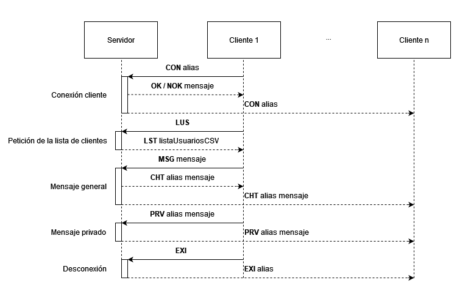
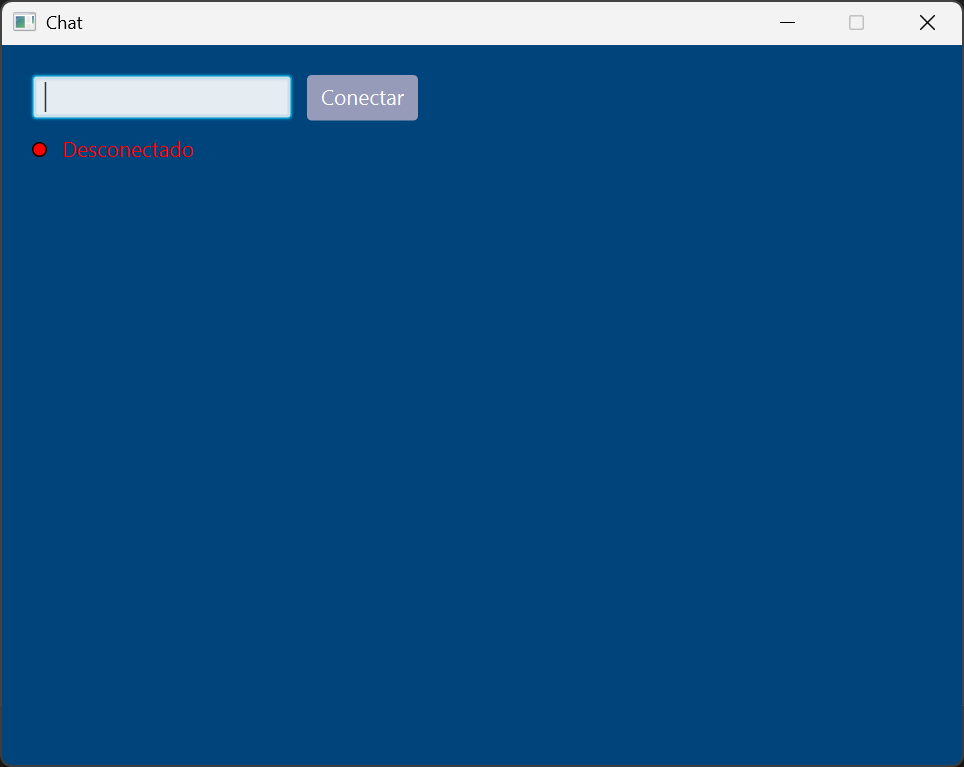
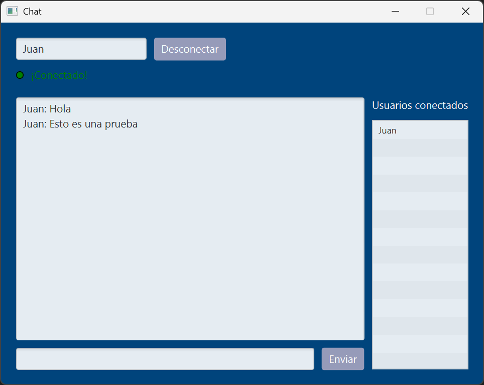
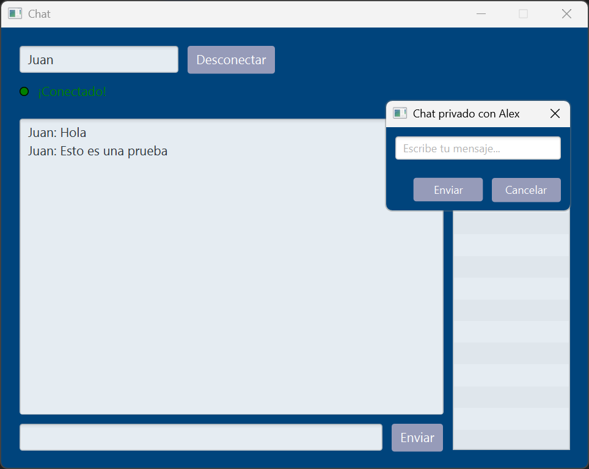
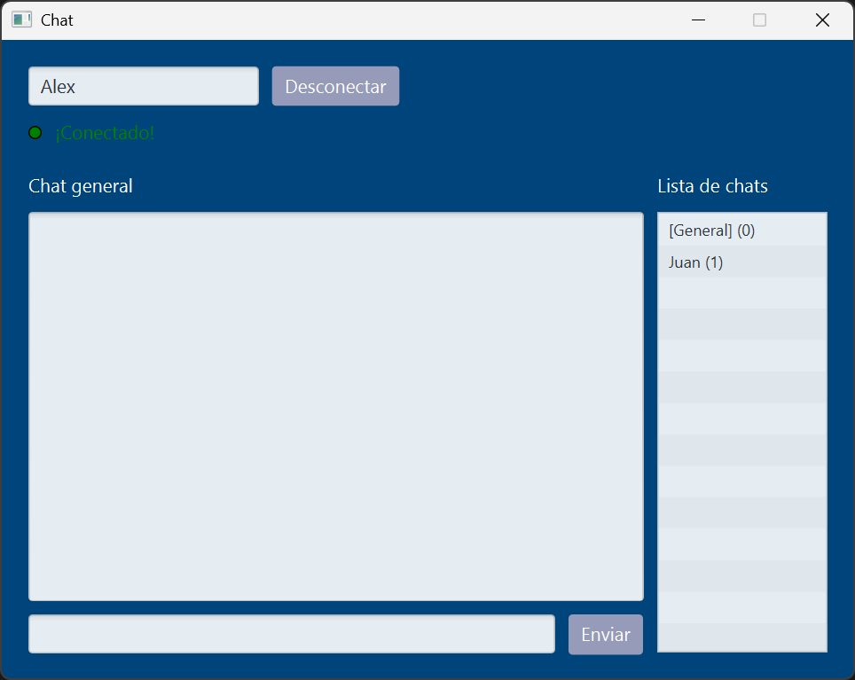
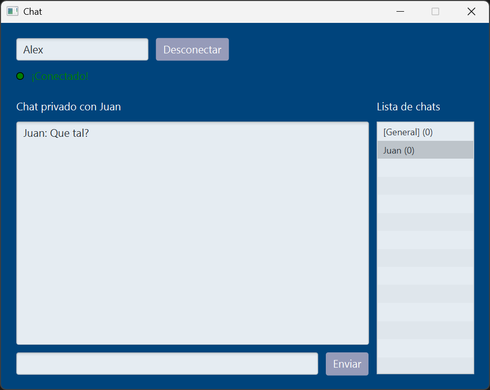
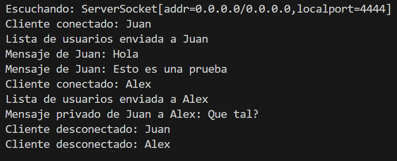

# Chat Multicliente

Trabajo para la asignatura de Programación de Servicios y Procesos.

## 📄 Descripción

Esta es una aplicación cliente-servidor en la que el servidor permanece a la espera de conexiones entrantes y crea un hilo para gestionar cada una de ellas, lo que le permite manejar múltiples clientes simultáneamente. Cada hilo se encarga de recibir solicitudes y enviar las respuestas correspondientes. Por otro lado, el cliente cuenta con una interfaz gráfica que inicia un hilo dedicado a escuchar las respuestas del servidor, actualizando la interfaz en tiempo real y gestionando el envío de solicitudes.

## 📂 Ejecutar la aplicación

- `es/chat/ServidorLanzador.java`: Lanzador del servidor (consola).
- `es/chat/ClienteLanzador.java`: Lanzador del cliente (interfaz gráfica).


## ⬇️ Descarga

- **Clona el repositorio:**
   ```bash
   git clone https://github.com/AdrianGM2001/Chat-Multicliente.git
   ```

## 📷 Imágenes
<p>
    
    
    
    
    
    
    
    
    
</p>